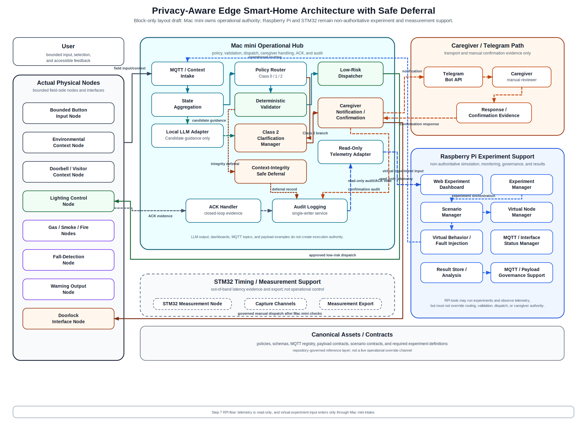

# 16_system_architecture_figure.md

> Legacy source note: The active architecture entry point is `00_architecture_index.md`. This file is retained for detailed source context and should not be used as the first active baseline.


## System Architecture Figure and Interpretation

## 1. Purpose

This document is the consolidated architecture-figure document for the `safe_deferral` project.

It supersedes the previously split architecture-figure notes from the 16~24 document range, including:

- `common/docs/architecture/24_final_paper_architecture_figure.md`

The purpose of this document is to provide one stable reference for:

- the paper-oriented system architecture figure,
- the operational closed-loop interpretation,
- Mac mini / Raspberry Pi 5 / ESP32 / measurement-node role separation,
- Class 2 clarification and transition-loop interpretation,
- low-risk vs sensitive-actuation routing,
- `doorbell_detected` visitor-response context,
- payload-boundary interpretation,
- MQTT topic / payload contract interpretation,
- MQTT/payload governance dashboard and backend boundary,
- and figure-caption guidance for the paper.

This document does **not** override frozen policies or schemas. If any conflict exists, the following remain authoritative or controlling references according to their scope:

- `common/policies/`
- `common/schemas/`
- `common/docs/architecture/13_doorlock_access_control_and_caregiver_escalation.md`
- `common/docs/architecture/14_system_components_outline_v2.md`
- `common/docs/architecture/15_interface_matrix.md`
- `common/docs/architecture/17_payload_contract_and_registry.md`
- `common/docs/architecture/19_class2_clarification_architecture_alignment.md`
- `common/docs/architecture/20_scenario_data_flow_matrix.md`
- `common/docs/required_experiments.md`
- `common/mqtt/topic_registry.json`
- `common/mqtt/publisher_subscriber_matrix.md`
- `common/mqtt/topic_payload_contracts.md`
- `common/payloads/README.md`

---

## 2. Final paper figure



This figure should be treated as the current active Mac-mini-centered operational architecture figure.

The current SVG now compactly represents:

- ESP32 bounded physical nodes,
- bounded input, context, emergency, and bounded actuator-interfacing nodes,
- Mac mini MQTT ingestion with registry-aware MQTT intake,
- context/runtime aggregation,
- local LLM-assisted reasoning,
- Policy Router plus Deterministic Validator as the final admissibility boundary,
- Class 1 low-risk execution as currently lighting only,
- safe deferral and clarification management,
- Class 2 clarification as a bounded transition loop,
- caregiver escalation and approval for governed manual dispatch,
- TTS guidance,
- ACK and audit closure,
- Raspberry Pi non-authoritative monitoring, orchestration, governance checks, and result publication,
- Raspberry Pi progress/result/governance report support.

However, the current SVG remains a compact paper figure. It does not fully draw every detailed support-layer connection, including:

- every Class 2 candidate-selection and re-routing arrow,
- all Raspberry Pi support-layer MQTT connections,
- complete MQTT/payload governance backend flow,
- governance dashboard UI flow,
- publisher/subscriber role management,
- payload example management,
- topic registry CRUD/review workflow,
- MQTT-aware interface matrix alignment checks,
- topic/payload hardcoding drift checks,
- payload validation report flow,
- governance backend/UI separation validation.

Those detailed elements are documented in this file, in `common/docs/architecture/14_system_components_outline_v2.md`, `common/docs/architecture/15_interface_matrix.md`, `common/docs/architecture/18_scenario_node_component_mapping.md`, `common/docs/architecture/19_class2_clarification_architecture_alignment.md`, and `common/docs/architecture/20_scenario_data_flow_matrix.md`.

### Current figure status

The current SVG figure is the active operational figure for the present paper-writing and architecture-discussion stage.

It is strongest for explaining:

- ESP32 bounded physical nodes,
- Mac mini operational control loop,
- local LLM-assisted interpretation,
- deterministic policy routing and validation,
- safe deferral,
- Class 2 clarification / transition handling,
- caregiver-mediated sensitive-actuation handling through governed manual dispatch,
- ACK and audit closure,
- Raspberry Pi non-authoritative experiment and governance-report support.

It intentionally uses compact labels rather than drawing all governance/backend implementation paths or all Class 2 clarification return arrows.

The Raspberry Pi 5 region is retained as a support-side monitoring, experiment, and governance-report layer, not as the primary operational control authority.

---

## 3. High-level architecture regions

The figure should be read as four major regions.

| Region | Role | Authority boundary |
|---|---|---|
| ESP32 device layer | Bounded physical input, sensing, emergency/event detection, doorbell / visitor-arrival context sensing, bounded actuator/warning interfaces | No high-level reasoning authority; no autonomous sensitive-actuation authority |
| Mac mini edge hub | Safety-critical operational hub for MQTT/state intake, local LLM, policy router, validator, safe deferral, Class 2 clarification manager, caregiver escalation, governed manual dispatch handling, ACK, audit, topic registry loading, and payload validation support | Primary operational authority under frozen policy/schema constraints; Class 2 clarification is not actuation authority; registry/payload helpers support consistency but do not create authority |
| Raspberry Pi 5 support region | Experiment dashboard, simulation, replay, fault injection, scenario orchestration, progress/result publication, MQTT/payload governance backend/UI support, topic/payload validation, payload example inspection, publisher/subscriber role review, governance reports | Experiment/support visibility and governance inspection; not policy, validator, caregiver approval, execution, direct registry-file editing, canonical policy/schema editing, actuator command publishing, doorlock command publishing, or Class 2 transition authority |
| Optional measurement node | Out-of-band timing and latency capture | Measurement-only; not operational control plane |

---

## 4. ESP32 device layer

The ESP32 layer represents field-side interaction and bounded actuation endpoints.

It may include:

- bounded button input node,
- emergency triple-hit input path,
- environmental sensing nodes,
- doorbell / visitor-arrival context node,
- lighting control node,
- optional gas/fire/fall sensing or event-interface nodes,
- planned governed sensitive-action or warning interface nodes.

Important interpretation:

1. ESP32 nodes are bounded physical nodes.
2. ESP32 nodes may emit events or states that are normalized into schema-valid payloads.
3. ESP32 nodes must not locally replace policy routing, validator logic, or caregiver approval.
4. ESP32 doorlock or warning interface nodes may exist for representative or caregiver-mediated evaluation, but must not reinterpret doorlock as autonomous Class 1 low-risk execution authority.
5. The paper figure uses “lighting and governed sensitive-action interface” and “bounded actuator interfacing” to avoid implying ESP32-local doorlock authority.
6. ESP32 bounded input or voice/selection input may provide confirmation evidence during Class 2 clarification, but this evidence must still re-enter Mac mini policy routing.

### Doorbell / visitor-arrival context

Doorbell or visitor-arrival context must be represented as:

```json
{
  "environmental_context": {
    "doorbell_detected": true
  }
}
```

or:

```json
{
  "environmental_context": {
    "doorbell_detected": false
  }
}
```

according to the scenario.

`doorbell_detected` is a required visitor-response context signal. It does **not** authorize autonomous doorlock control.

---

## 5. Mac mini edge hub

The Mac mini region is the operational control core.

Its L-shaped boundary includes the caregiver-approval region in the same host-level operational enclosure. This reflects the interpretation that caregiver approval handling is not external to the control loop, but a governed part of the operational architecture.

The Mac mini region includes:

- MQTT ingestion and state intake,
- registry-aware MQTT intake where practical,
- context and runtime aggregation,
- local LLM reasoning,
- Policy Router,
- Deterministic Validator,
- MQTT topic registry loader / contract checker,
- payload validation helper,
- context-integrity-based safe deferral stage,
- Class 2 Clarification Manager,
- caregiver escalation,
- caregiver approval handling,
- governed manual dispatch handling for sensitive actions,
- TTS rendering or user feedback generation,
- approved low-risk dispatch interface,
- ACK handling,
- local audit logging.

### 5.1 Class 2 clarification loop interpretation

The compact figure should be read as supporting the following Class 2 loop, even if every arrow is not drawn in the SVG:

```text
Ambiguous / insufficient input
→ Policy Router / Deterministic Validator blocks direct execution
→ Safe Deferral and Clarification Management
→ Class 2 Clarification Manager
→ bounded candidate presentation through TTS/Display
→ user/caregiver confirmation, timeout, or deterministic emergency evidence
→ Policy Router re-entry
→ Class 1, Class 0, Safe Deferral, or Caregiver Confirmation
→ audit closure
```

Authority boundary:

```text
Class 2 Clarification Manager ≠ final class decision authority
Class 2 Clarification Manager ≠ actuator authority
LLM candidate text ≠ validator approval
LLM candidate text ≠ emergency trigger
Clarification selection ≠ validator bypass
```

The topic registry loader and payload validation helper support:

- registry-based topic lookup where practical,
- publisher/subscriber contract checking,
- publisher/subscriber role consistency checking,
- interface-matrix alignment checking,
- topic/payload hardcoding drift detection where implemented,
- schema/payload boundary consistency,
- `doorbell_detected` required-field checks,
- clarification interaction payload boundary checks,
- and prevention of doorlock state drift into current pure-context `device_states`.

These helpers support communication consistency, schema/payload boundary checks, and governance/verification evidence. They do not replace policy/schema authority, do not create actuator authority, and do not function as operational authorization mechanisms.

The compact paper figure visually groups Policy Router and Deterministic Validator in one block. This grouping is only visual: deterministic validation remains the final admissibility boundary and cannot be bypassed.

The Mac mini may expose operational telemetry, audit summaries, and control-state topics consumed by the Raspberry Pi 5 dashboard. This exposure does not make the RPi dashboard a policy authority.

---

## 6. Raspberry Pi 5 support region

The Raspberry Pi 5 region is the support-side experiment, monitoring, and governance-report layer.

It may include:

- Monitoring / Experiment Dashboard,
- approval-status visibility only,
- experiment support runtime,
- simulation and replay,
- virtual sensor and state generation,
- virtual `doorbell_detected` visitor-response context generation,
- virtual emergency event generation,
- fault injection,
- scenario orchestration,
- Class 2 clarification transition evaluation,
- progress/status publication,
- result summaries,
- validation reports,
- governance reports,
- CSV/graph export,
- evaluation artifact generation,
- MQTT/payload governance backend,
- governance dashboard UI,
- topic/payload contract validation,
- interface-matrix alignment validation,
- topic/payload drift report generation,
- payload validation report generation,
- governance backend/UI separation validation,
- payload example manager,
- publisher/subscriber role manager.

The RPi dashboard is a support-side visibility and experiment-operations console.

The MQTT/payload governance backend and governance dashboard UI may be documented as part of the Raspberry Pi support-side toolchain even if their visual links are not fully drawn in the current SVG figure.

They may support:

- topic registry browsing,
- draft topic creation/edit/delete workflows,
- publisher/subscriber role review,
- payload family and schema/example linkage,
- payload example validation,
- clarification interaction payload validation,
- interface-matrix alignment validation,
- topic/payload drift report generation,
- payload validation report generation,
- governance backend/UI separation validation,
- proposed change reports,
- live or replayed topic traffic inspection,
- Class 2 clarification boundary warnings,
- doorbell/doorlock boundary warnings.

They are **not**:

- policy authority,
- validator authority,
- caregiver approval authority,
- primary operational hub,
- direct sensitive-actuation authority,
- direct doorlock dispatch authority,
- canonical schema/policy editing authority,
- direct registry-file editing authority through the UI,
- actuator or doorlock command publishing authority,
- caregiver approval spoofing authority,
- Class 2 transition authority,
- a path for draft/proposed changes to become live operational authority without review.

The RPi dashboard and orchestration layers may visualize visitor-response, Class 2 clarification, or doorlock-sensitive experiment state, including:

- `doorbell_detected` state,
- clarification candidate state,
- selected candidate / timeout state,
- Policy Router re-entry result,
- autonomous-unlock-blocked status,
- caregiver escalation state,
- manual approval state,
- ACK state,
- audit completeness state.

These dashboard states are observation/evaluation payloads, not canonical pure-context device states and not policy truth.

---

## 7. Optional measurement node region

STM32 timing nodes or equivalent dedicated timing devices may be used as out-of-band measurement infrastructure for class-wise latency experiments.

They are used for:

- timing capture,
- latency evidence collection,
- trigger/observe/actuation timestamp export,
- repeated-run reproducibility support.

They must not:

- publish operational control decisions,
- replace policy routing,
- replace validator behavior,
- directly control actuators as part of the operational path,
- be treated as ordinary operational physical nodes.

---

## 8. Operational closed-loop interpretation

The closed loop consists of the following steps.

### Step 1. Bounded input and context ingestion

Input may originate from:

- bounded physical button input,
- environmental sensing,
- emergency sensors/events,
- doorbell / visitor-arrival context,
- simulated RPi scenario input during experiments.

MQTT-facing interfaces should remain aligned with:

- `common/mqtt/topic_registry.json`
- `common/mqtt/publisher_subscriber_matrix.md`
- `common/mqtt/topic_payload_contracts.md`
- `common/docs/architecture/15_interface_matrix.md`

For `safe_deferral/context/input`, the ordinary operational publishers are field-side bounded input/context nodes, with controlled RPi simulation publishers allowed only in gated experiment mode. Mac mini services primarily ingest and aggregate this input plane.

The normalized operational input must preserve the payload boundaries defined in:

- `common/docs/architecture/17_payload_contract_and_registry.md`

In particular:

- `routing_metadata` must not be mixed into LLM context,
- `pure_context_payload` must conform to `context_schema.json`,
- every valid `environmental_context` must include `doorbell_detected`,
- doorlock state must not be inserted into current `device_states`.

### Step 2. Local LLM-assisted intent interpretation

The local LLM may assist with:

- intent recovery under constrained input,
- status explanations,
- safe-deferral reasons,
- bounded next-input suggestions.

The LLM must not become the execution authority.

The LLM output should be interpreted as a bounded candidate or interpretation artifact that must still pass deterministic policy and schema constraints.

### Step 3. Policy routing

The Policy Router performs deterministic class routing according to the frozen policy table.

Current major outcomes:

- Class 0 emergency override,
- Class 1 bounded low-risk assistance,
- Class 2 clarification / transition handling.

The current canonical emergency family is:

- `E001`: high temperature threshold crossing,
- `E002`: emergency triple-hit bounded input,
- `E003`: smoke detected state trigger,
- `E004`: gas detected state trigger,
- `E005`: fall detected event trigger.

`doorbell_detected` is not a Class 0 emergency trigger.

### Step 4. Deterministic validation

The Deterministic Validator checks whether a proposed Class 1 candidate is admissible.

It enforces:

- schema validity,
- action-domain validity,
- single-admissible-action resolution,
- low-risk catalog membership,
- safe fallback under conflict or ambiguity.

Current autonomous Class 1 execution remains limited to:

- `light_on` → `living_room_light`,
- `light_on` → `bedroom_light`,
- `light_off` → `living_room_light`,
- `light_off` → `bedroom_light`.

Doorlock control is not current autonomous Class 1 execution.

### Step 5. Approved low-risk execution or safe deferral

If exactly one admissible low-risk action remains, the system may forward the approved action to the bounded dispatcher / actuator interface.

If ambiguity, insufficient context, schema problems, policy conflict, or unresolved multiple candidates remain, the system must prefer:

- safe deferral,
- bounded clarification,
- or Class 2 escalation,

rather than unsafe autonomous actuation.

### Step 5A. Class 2 clarification and transition handling

Class 2 is a bounded clarification and transition state.

It may proceed through:

```text
Class 2 entry
→ bounded candidate generation
→ TTS/Display presentation
→ user/caregiver selection, timeout, or deterministic evidence
→ Policy Router re-entry
→ Class 1 / Class 0 / Safe Deferral / Caregiver Confirmation
```

The clarification interaction payload is governed by:

```text
common/schemas/clarification_interaction_schema.json
```

The Class 2 path must not:

- infer intent from no response,
- dispatch actuators directly,
- treat candidate text as validator approval,
- treat candidate text as emergency trigger evidence,
- authorize doorlock unlock,
- bypass Policy Router re-entry,
- bypass Deterministic Validator for Class 1 execution.

### Step 6. Caregiver-mediated sensitive path

Sensitive requests, including doorlock-related requests, must not be routed as ordinary Class 1 autonomous low-risk execution.

Doorlock-sensitive outcomes should proceed through:

- Class 2 escalation,
- separately governed manual confirmation path,
- caregiver approval,
- governed manual dispatch,
- ACK verification,
- local audit logging.

`doorbell_detected=true` may support visitor-response interpretation, but it does not authorize door unlock.

### Step 7. User feedback and TTS

The figure’s TTS/user-feedback path should be interpreted as policy-constrained output.

LLM-generated explanation or status text is not treated as directly speakable raw output. It should be constrained by policy routing, validator decisions, safe-deferral outcomes, Class 2 clarification state, and output profile guidance.

### Step 8. ACK and audit closure

Every execution path that results in actuation must support closed-loop outcome evidence.

Audit closure may include:

- route decision,
- LLM interpretation/candidate summary,
- clarification candidate choices,
- user/caregiver selection result,
- timeout/no-response result,
- transition target,
- validator decision,
- safe deferral or escalation reason,
- caregiver approval outcome when applicable,
- dispatch result,
- ACK result,
- final non-actuation or actuation outcome.

Audit records are evidence and traceability artifacts. They do not redefine policy truth.

### Step 9. MQTT/payload governance support path

The MQTT/payload governance support path is separate from the operational closed loop.

It may include:

- Governance Dashboard UI,
- MQTT/payload governance backend,
- topic registry loader / contract checker,
- payload example manager / validator,
- publisher/subscriber role manager,
- interface-matrix alignment reports,
- topic-drift reports,
- payload validation reports,
- clarification interaction payload validation reports,
- draft registry change reports,
- proposed-change reports,
- review/commit workflow.

This path may inspect, validate, and propose communication-contract changes. It must not:

- publish actuator commands,
- publish doorlock commands,
- modify canonical policies/schemas directly,
- create doorlock execution authority,
- spoof caregiver approval,
- bypass deterministic validation,
- treat clarification payloads as authorization,
- or treat dashboard observation as policy truth.

Interface-matrix alignment reports, topic-drift reports, payload validation reports, clarification payload validation reports, and proposed-change reports are governance/verification artifacts, not operational authorization mechanisms.

---

## 9. Payload interpretation in the figure

The architecture figure should be read with the following payload boundaries.

| Payload / state | Belongs where | Does not belong where |
|---|---|---|
| `routing_metadata` | Policy Router input wrapper, audit correlation, staleness handling | LLM prompt context |
| `pure_context_payload` | LLM-relevant physical/context input | Dashboard-only state, manual approval state, ACK state, Class 2 clarification state |
| `environmental_context.doorbell_detected` | Required visitor-response context | Doorlock authorization |
| current `device_states` | `living_room_light`, `bedroom_light`, `living_room_blind`, `tv_main` | Doorlock state |
| `clarification_interaction_payload` | Candidate choices, presentation channel, user/caregiver response, timeout result, transition target, final safe outcome | Pure context, validator approval, actuator command, emergency trigger, doorlock authorization |
| doorlock state | Experiment annotation, dashboard observation, audit artifact, manual confirmation path, future schema | Current `pure_context_payload.device_states` |
| manual approval state | Caregiver/manual confirmation path, experiment artifact, audit | Pure context payload |
| ACK state | Actuator result, audit, dashboard observation, experiment artifact | Pure context payload |
| dashboard observation state | RPi support-side visibility | Policy truth or validator authority |
| MQTT topic registry | `common/mqtt/`, governance backend, validation reports, review/commit workflow | Policy/schema authority or actuator authorization |
| payload examples/templates | `common/payloads/`, payload validation helper, governance backend, test/scenario scaffolds | Policy truth or schema authority |
| governance draft changes | Governance backend, validation report, review/commit workflow | Live runtime control or doorlock execution authority |
| interface-matrix alignment report | Governance backend, verification report, dashboard artifact | Operational authorization |
| topic-drift report | Governance backend, verification report, dashboard artifact | Policy truth or execution authority |
| payload validation report | Governance backend, verification report, dashboard artifact | Schema authority or actuation authority |

Detailed payload rules are defined in:

- `common/docs/architecture/17_payload_contract_and_registry.md`

Detailed interface and topic coverage are defined in:

- `common/docs/architecture/15_interface_matrix.md`

---

## 10. Figure elements compactly represented vs not fully drawn

The current SVG compactly represents:

- Raspberry Pi progress/result/governance reports,
- registry-aware MQTT intake,
- Policy Router + Deterministic Validator grouping,
- safe deferral and clarification management,
- governed manual dispatch wording,
- lighting-only current Class 1 execution,
- bounded ESP32 actuator interfacing.

The current SVG does not fully draw:

- every Class 2 candidate-generation, selection, timeout, and Policy Router re-entry arrow,
- all Raspberry Pi support-layer MQTT connections,
- dashboard observation topic flows,
- experiment progress/result topic flows,
- full MQTT/payload governance backend API flow,
- governance dashboard UI flow,
- publisher/subscriber role manager,
- payload example manager,
- topic registry CRUD/review workflow,
- MQTT-aware interface matrix alignment check,
- topic drift check,
- payload validation report flow,
- governance backend/UI separation validation flow.

Until a more detailed support/governance figure or Class 2 interaction figure is created, the explanatory text in this document and the MQTT-aware interface matrix in `common/docs/architecture/15_interface_matrix.md` should be used to interpret the full support-layer, governance-layer, and Class 2 clarification/transition design.

---

## 11. Figure caption draft

Suggested paper caption:

> System architecture of the proposed privacy-aware edge smart-home system. Field-side ESP32 nodes provide bounded input, sensing, emergency-event, doorbell/visitor-arrival context, and bounded actuator or warning interfaces. The Mac mini edge hub performs local context aggregation, LLM-assisted intent interpretation, deterministic policy routing, deterministic validation, registry-aware communication consistency checks, interface-matrix alignment, topic/payload drift detection, payload-boundary validation support, context-integrity-based safe deferral, Class 2 bounded clarification and transition handling, caregiver-mediated escalation, governed manual dispatch for sensitive actions, ACK handling, and local audit logging. Class 2 is interpreted as a bounded clarification loop in which ambiguous or insufficient-context inputs may lead to candidate presentation and user/caregiver confirmation before re-routing to Class 1, Class 0, Safe Deferral, or Caregiver Confirmation. The Raspberry Pi 5 region provides support-side experiment orchestration, monitoring, simulation, fault injection, progress/result/governance report publication, evaluation artifact generation, and non-authoritative MQTT/payload governance tooling for topic registry inspection, payload validation, publisher/subscriber role review, interface-matrix alignment, topic/payload drift reporting, and validation report generation, without becoming policy or execution authority.

Shorter caption:

> Overall system architecture showing bounded physical input, local LLM-assisted interpretation, deterministic policy validation, Class 2 bounded clarification, safe deferral, caregiver-mediated sensitive actuation through governed manual dispatch, local audit closure, and Raspberry Pi-based experiment monitoring with non-authoritative MQTT/payload governance-report support.

---

## 12. Paper interpretation notes

This figure supports the paper’s main claims because it shows:

1. LLM assistance is present but not authoritative.
2. Deterministic policy and validator stages remain central.
3. Safe deferral is a first-class outcome rather than an error state.
4. Class 2 clarification is a bounded transition loop, not autonomous actuation or terminal failure by default.
5. Sensitive actuation is separated from low-risk autonomous execution.
6. Caregiver approval is modeled as a governed path.
7. Governed manual dispatch is required for sensitive actions.
8. ACK and audit closure are part of the closed loop.
9. RPi dashboard/simulation/governance-report support is an experiment-support layer, not operational authority.
10. Payload boundaries are necessary to prevent state and authority drift.
11. MQTT/payload governance is separated from operational authority.
12. Topic/payload registry edits cannot create doorlock execution authority.
13. Clarification payloads cannot create validator, actuator, emergency, or doorlock authority.
14. Some RPi/governance/Class 2 connections are compactly represented but not fully drawn in the current SVG.
15. Interface-matrix alignment and topic/payload drift checks are governance/verification evidence, not execution authority.
16. Governance dashboard UI and governance backend separation is part of the safety boundary.

---

## 13. Superseded / historical notes

This document consolidates the architecture-figure interpretation that was previously spread across multiple architecture files in the 16~24 range.

The most important prior document was:

- `common/docs/architecture/24_final_paper_architecture_figure.md`

If older architecture-figure notes conflict with this document, prefer this consolidated document together with:

- `common/docs/architecture/15_interface_matrix.md`
- `common/docs/architecture/17_payload_contract_and_registry.md`
- `common/docs/architecture/19_class2_clarification_architecture_alignment.md`
- `common/docs/architecture/20_scenario_data_flow_matrix.md`
- `common/docs/required_experiments.md`
- `common/docs/runtime/SESSION_HANDOFF.md`

---

## 14. Summary

The final architecture figure should be read as a closed-loop, policy-first, edge-local assistive control architecture.

The key interpretation is:

- ESP32 nodes provide bounded physical interaction and sensing.
- Mac mini is the safety-critical operational edge hub.
- The local LLM assists intent interpretation but does not authorize execution.
- Deterministic policy and validation control admissibility.
- Class 1 low-risk autonomous execution is currently lighting only.
- Class 2 clarification is a bounded transition loop with Policy Router re-entry.
- Safe deferral and caregiver escalation prevent unsafe autonomous action.
- Doorbell context supports visitor-response interpretation but does not authorize doorlock control.
- Doorlock-sensitive execution remains caregiver-mediated and governed by manual dispatch.
- RPi provides experiment/dashboard/simulation/fault-injection/governance-report support without becoming authority.
- MQTT/payload governance tooling may inspect, validate, and propose communication-contract changes without becoming operational authority.
- Interface-matrix alignment, topic-drift checks, and payload validation reports support governance/verification only.
- Governance dashboard UI and backend service separation prevents registry-management tooling from becoming control authority.
- ACK and audit closure complete the safety argument.
