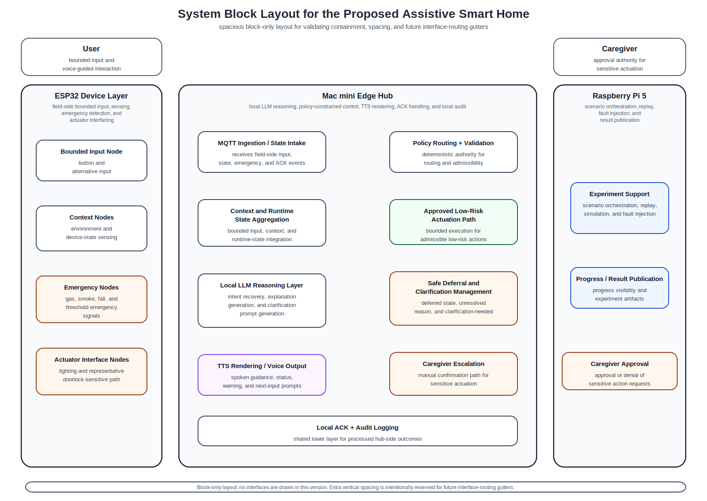

# 16_system_block_layout_spacious.md

## 1. Purpose

This document records the current **block-only spacious layout** used before interface routing is drawn.

It exists to validate the following before adding any interfaces:
- all sub-blocks remain inside their parent blocks,
- all text remains inside each block,
- enough vertical spacing exists between sub-blocks,
- and routing gutters remain available for later interface drawing.

This document should be read together with:
- `common/docs/architecture/14_system_components_outline_v2.md`
- `common/docs/architecture/15_interface_matrix.md`

---

## 2. Current block-only spacious layout

---

## 3. Interpretation notes

This figure intentionally does **not** draw any interfaces.

Its purpose is to lock the spatial arrangement of:
- external actors,
- top-level hosts,
- and host-internal sub-blocks,

before interface routing is attempted.

The current layout decisions are:
- `User` has the same width as the `ESP32 Device Layer` block,
- `Caregiver` has the same width as the `Raspberry Pi 5` block,
- `Local ACK + Audit Logging` is drawn as a shared lower layer spanning the full internal width of the Mac mini sub-block area,
- and extra vertical space is intentionally reserved between sub-blocks for future routing gutters.

---

## 4. Use guidance

When interfaces are later added to this figure, the following constraints should continue to hold:

1. all sub-blocks must remain inside their parent block,
2. no text may leave its block,
3. interfaces should not pass through blocks,
4. interfaces should not overlap unnecessarily,
5. start and end blocks must remain visually unambiguous.

If any later routed version violates these rules, this block-only spacious layout should be treated as the baseline to return to.
