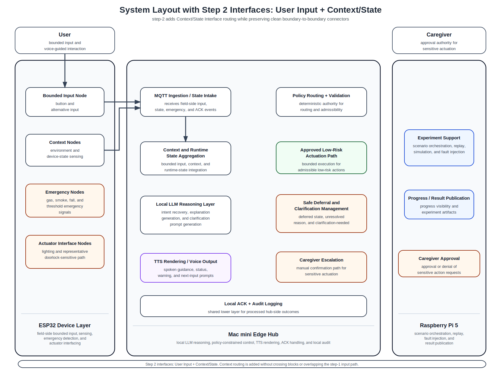

# 17_system_layout_step2_user_input_plus_context.md

## 1. Purpose

This document records the current **step-2 routed layout** in which the following interfaces are drawn:

- User Input Interface
- Context / State Interface

This routed version is still intentionally partial.
It exists to validate routing quality incrementally before additional interface categories are added.

This document should be read together with:
- `common/docs/architecture/14_system_components_outline_v2.md`
- `common/docs/architecture/15_interface_matrix.md`
- `common/docs/architecture/16_system_block_layout_spacious.md`

---

## 2. Current step-2 routed layout

---

## 3. What is included in this step

The routed interfaces currently included are:

### User Input Interface
- `User → Bounded Input Node`
- `Bounded Input Node → MQTT Ingestion / State Intake`

### Context / State Interface
- `Context Nodes → MQTT Ingestion / State Intake`
- `MQTT Ingestion / State Intake → Context and Runtime State Aggregation`

No additional interface categories should be inferred from this figure yet.

---

## 4. Routing intent at this step

This step is intended to verify that:
- connectors terminate at exact block boundaries,
- routed lines do not pass through blocks,
- routed lines do not unnecessarily overlap,
- upper and inter-block routing space remains usable,
- and the block-only spacious layout remains stable under the first two interface categories.

---

## 5. Next expected step

The next interface category to add after this figure is:

- **Emergency Interface**

That next step should preserve the existing routed paths while keeping emergency handling visually distinct from the local-LLM assistive path.
