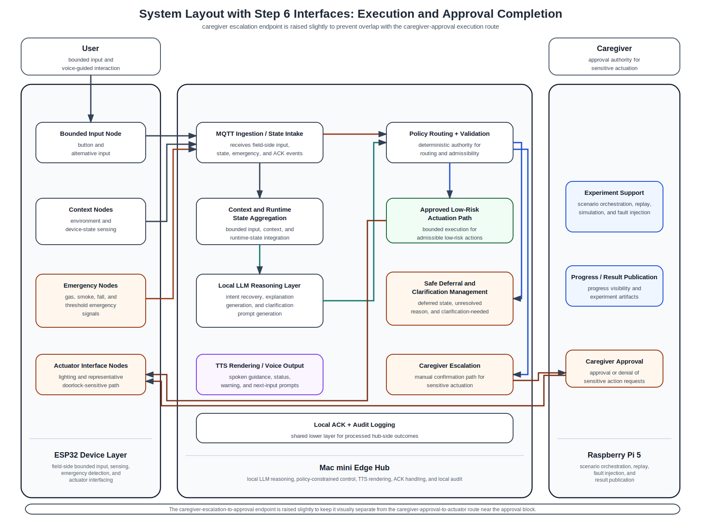

# 20_system_layout_step6_execution_completion.md

## 1. Purpose

This document records the current **step-6 routed layout** in which the following interface categories are drawn:

- User Input Interface
- Context / State Interface
- Emergency Interface
- LLM Reasoning Interface
- Policy / Validation Branching Interface
- Execution / Approval Completion Interface

This routed version is still intentionally partial.
It exists to validate how policy-approved actuation reaches the ESP32 actuator layer, and how sensitive actions traverse caregiver escalation and caregiver approval before execution.

This document should be read together with:
- `common/docs/architecture/14_system_components_outline_v2.md`
- `common/docs/architecture/15_interface_matrix.md`
- `common/docs/architecture/16_system_block_layout_spacious.md`
- `common/docs/architecture/17_system_layout_step2_user_input_plus_context.md`
- `common/docs/architecture/18_system_layout_step4_with_llm_reasoning.md`
- `common/docs/architecture/19_system_layout_step5_policy_branching.md`

---

## 2. Current step-6 routed layout

---

## 3. What is included in this step

The routed interfaces currently included are:

### User Input Interface
- `User → Bounded Input Node`
- `Bounded Input Node → MQTT Ingestion / State Intake`

### Context / State Interface
- `Context Nodes → MQTT Ingestion / State Intake`
- `MQTT Ingestion / State Intake → Context and Runtime State Aggregation`

### Emergency Interface
- `Emergency Nodes → MQTT Ingestion / State Intake`
- `MQTT Ingestion / State Intake → Policy Routing + Validation`

### LLM Reasoning Interface
- `Context and Runtime State Aggregation → Local LLM Reasoning Layer`
- `Local LLM Reasoning Layer → Policy Routing + Validation`

### Policy / Validation Branching Interface
- `Policy Routing + Validation → Approved Low-Risk Actuation Path`
- `Policy Routing + Validation → Safe Deferral and Clarification Management`
- `Policy Routing + Validation → Caregiver Escalation`

### Execution / Approval Completion Interface
- `Approved Low-Risk Actuation Path → Actuator Interface Nodes`
- `Caregiver Escalation → Caregiver Approval`
- `Caregiver Approval → Actuator Interface Nodes`

TTS feedback, clarification return paths, ACK completion paths, and experiment-support publication completion paths should still be treated as not yet drawn in this figure.

---

## 4. Routing intent at this step

This step is intended to verify that:
- approved low-risk actions can be shown as reaching the actuator layer directly,
- sensitive actions do not reach the actuator layer directly from escalation,
- caregiver escalation first reaches caregiver approval,
- caregiver approval then connects to the actuator layer as a distinct downstream path,
- and execution-completion routing remains separable from the audit layer and existing policy branches.

This figure therefore supports the paper’s safety-architecture claim that:
- the system differentiates between directly admissible low-risk actuation and sensitive actuation that must traverse caregiver approval,
- and the actuator layer is only reached through policy-approved or caregiver-approved downstream paths.

---

## 5. Next expected step

The next interface category to add after this figure is:

- **TTS / clarification return paths**

That next step should show routes such as:
- safe deferral or clarification output toward `TTS Rendering / Voice Output`,
- approved or deferred status explanation toward `TTS Rendering / Voice Output`,
- and user-facing clarification guidance that conceptually supports a later re-entry through the bounded input path.

After that, the next layers to add are typically:
- ACK completion paths into `Local ACK + Audit Logging`
- optional experiment-support / result-publication paths if they are still desired in the paper figure scope
