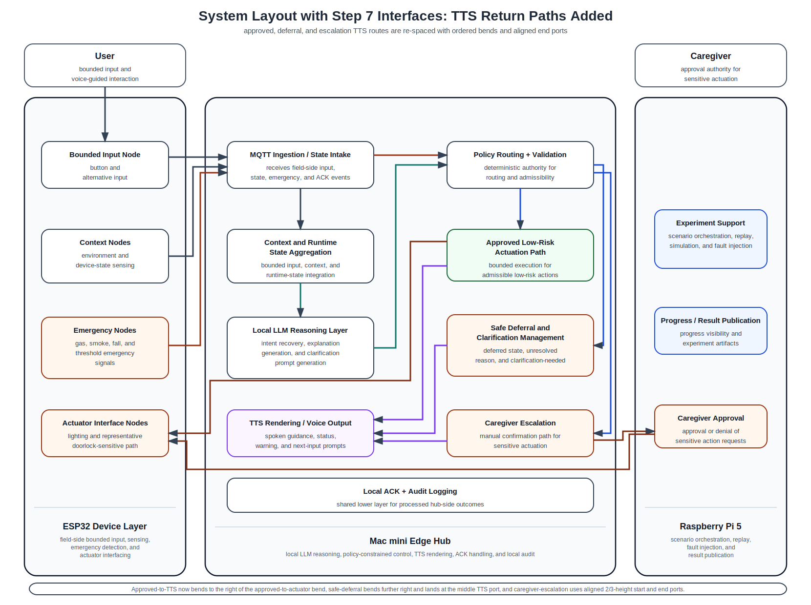

# 21_system_layout_step7_tts_return_paths.md

## 1. Purpose

This document records the current **step-7 routed layout** in which the following interface categories are drawn:

- User Input Interface
- Context / State Interface
- Emergency Interface
- LLM Reasoning Interface
- Policy / Validation Branching Interface
- Execution / Approval Completion Interface
- TTS / Clarification Return Interface

This routed version is still intentionally partial.
It exists to validate how system outcomes are converted into spoken user-facing feedback after policy branching and execution routing have already been established.

This document should be read together with:
- `common/docs/architecture/14_system_components_outline_v2.md`
- `common/docs/architecture/15_interface_matrix.md`
- `common/docs/architecture/16_system_block_layout_spacious.md`
- `common/docs/architecture/17_system_layout_step2_user_input_plus_context.md`
- `common/docs/architecture/18_system_layout_step4_with_llm_reasoning.md`
- `common/docs/architecture/19_system_layout_step5_policy_branching.md`
- `common/docs/architecture/20_system_layout_step6_execution_completion.md`

---

## 2. Current step-7 routed layout

---

## 3. What is included in this step

The routed interfaces currently included are:

### User Input Interface
- `User → Bounded Input Node`
- `Bounded Input Node → MQTT Ingestion / State Intake`

### Context / State Interface
- `Context Nodes → MQTT Ingestion / State Intake`
- `MQTT Ingestion / State Intake → Context and Runtime State Aggregation`

### Emergency Interface
- `Emergency Nodes → MQTT Ingestion / State Intake`
- `MQTT Ingestion / State Intake → Policy Routing + Validation`

### LLM Reasoning Interface
- `Context and Runtime State Aggregation → Local LLM Reasoning Layer`
- `Local LLM Reasoning Layer → Policy Routing + Validation`

### Policy / Validation Branching Interface
- `Policy Routing + Validation → Approved Low-Risk Actuation Path`
- `Policy Routing + Validation → Safe Deferral and Clarification Management`
- `Policy Routing + Validation → Caregiver Escalation`

### Execution / Approval Completion Interface
- `Approved Low-Risk Actuation Path → Actuator Interface Nodes`
- `Caregiver Escalation → Caregiver Approval`
- `Caregiver Approval → Actuator Interface Nodes`

### TTS / Clarification Return Interface
- `Approved Low-Risk Actuation Path → TTS Rendering / Voice Output`
- `Safe Deferral and Clarification Management → TTS Rendering / Voice Output`
- `Caregiver Escalation → TTS Rendering / Voice Output`

ACK-completion paths and optional experiment-support publication completion paths should still be treated as not yet drawn in this figure.

---

## 4. Routing intent at this step

This step is intended to verify that:
- spoken user feedback is shown as a distinct downstream layer after policy branching,
- approved low-risk actions can still produce spoken status feedback,
- safe deferral can produce clarification or deferral guidance through TTS,
- caregiver escalation can produce user-facing escalation status through TTS,
- and these TTS return paths can be arranged with ordered entry ports so they remain readable and non-overlapping.

This figure therefore supports the paper’s assistive-interaction claim that:
- system outcomes are not only internally routed,
- but are also converted into explicit spoken guidance for the user,
- including status explanation, deferral explanation, and escalation-state explanation.

---

## 5. Next expected step

The next interface category to add after this figure is:

- **ACK / audit completion paths**

That next step should show routes such as:
- actuator-side acknowledgements toward `Local ACK + Audit Logging`,
- caregiver approval / execution acknowledgements toward `Local ACK + Audit Logging`,
- and any additional local processing outcomes that should be reflected in the local audit layer.

After that, an optional final layer may still add:
- experiment-support / result-publication paths if they are still desired within the paper-figure scope
