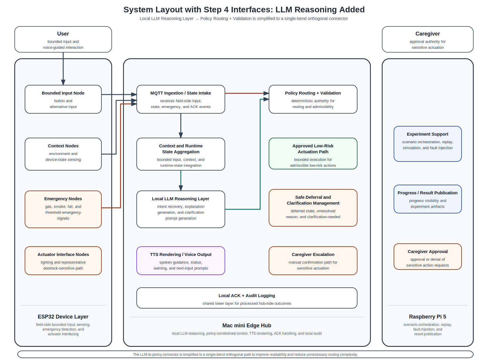

# 18_system_layout_step4_with_llm_reasoning.md

## 1. Purpose

This document records the current **step-4 routed layout** in which the following interface categories are drawn:

- User Input Interface
- Context / State Interface
- Emergency Interface
- LLM Reasoning Interface

This routed version is still intentionally partial.
It exists to validate the reasoning-layer connection and its relationship to deterministic policy routing before downstream branching and execution paths are added.

This document should be read together with:
- `common/docs/architecture/14_system_components_outline_v2.md`
- `common/docs/architecture/15_interface_matrix.md`
- `common/docs/archive/system_layout_figure_notes/16_system_block_layout_spacious.md`
- `common/docs/archive/system_layout_figure_notes/17_system_layout_step2_user_input_plus_context.md`

---

## 2. Current step-4 routed layout

---

## 3. What is included in this step

The routed interfaces currently included are:

### User Input Interface
- `User → Bounded Input Node`
- `Bounded Input Node → MQTT Ingestion / State Intake`

### Context / State Interface
- `Context Nodes → MQTT Ingestion / State Intake`
- `MQTT Ingestion / State Intake → Context and Runtime State Aggregation`

### Emergency Interface
- `Emergency Nodes → MQTT Ingestion / State Intake`
- `MQTT Ingestion / State Intake → Policy Routing + Validation`

### LLM Reasoning Interface
- `Context and Runtime State Aggregation → Local LLM Reasoning Layer`
- `Local LLM Reasoning Layer → Policy Routing + Validation`

No downstream execution or escalation branching should be inferred from this figure yet.

---

## 4. Role of the local LLM at this step

At this stage, the local LLM should be interpreted as contributing not only to intent recovery but also to explanation-oriented language generation.
This includes language candidates such as:
- current-status descriptions,
- safe-deferral reasons,
- and next-input suggestions.

However, these language candidates are not treated as independent user-facing outputs.
They are forwarded together with the interpreted intent to `Policy Routing + Validation`, so that any later spoken or action-related output remains policy-constrained rather than directly emitted from the LLM layer.

---

## 5. Routing intent at this step

This step is intended to verify that:
- the local LLM receives aggregated bounded input and context rather than raw actuator authority,
- emergency handling remains visually distinct from the assistive LLM path,
- the LLM-to-policy connection remains direct and readable,
- and deterministic policy routing is still depicted as the control authority after reasoning.

This figure therefore supports the paper’s core structural claim that:
- the local LLM contributes to intent recovery and explanation generation,
- but policy routing and validation still govern action admissibility and any later user-facing output.

---

## 6. Next expected step

The next interface category to add after this figure is:

- **Policy / Validation branching**

That next step should show how policy output branches into:
- approved low-risk actuation,
- safe deferral and clarification management,
- and caregiver escalation.
