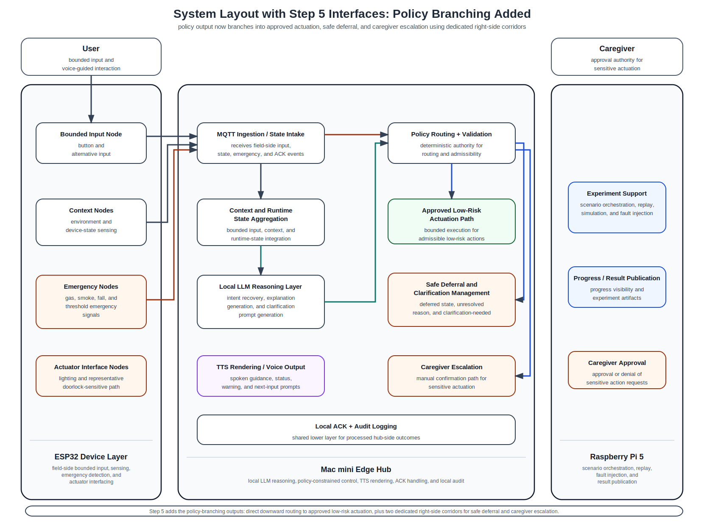

# 19_system_layout_step5_policy_branching.md

## 1. Purpose

This document records the current **step-5 routed layout** in which the following interface categories are drawn:

- User Input Interface
- Context / State Interface
- Emergency Interface
- LLM Reasoning Interface
- Policy / Validation Branching Interface

This routed version is still intentionally partial.
It exists to validate how deterministic policy output branches after reasoning, before execution, escalation completion, TTS feedback, and ACK/audit paths are added.

This document should be read together with:
- `common/docs/architecture/14_system_components_outline_v2.md`
- `common/docs/architecture/15_interface_matrix.md`
- `common/docs/archive/system_layout_figure_notes/16_system_block_layout_spacious.md`
- `common/docs/archive/system_layout_figure_notes/17_system_layout_step2_user_input_plus_context.md`
- `common/docs/archive/system_layout_figure_notes/18_system_layout_step4_with_llm_reasoning.md`

---

## 2. Current step-5 routed layout

---

## 3. What is included in this step

The routed interfaces currently included are:

### User Input Interface
- `User → Bounded Input Node`
- `Bounded Input Node → MQTT Ingestion / State Intake`

### Context / State Interface
- `Context Nodes → MQTT Ingestion / State Intake`
- `MQTT Ingestion / State Intake → Context and Runtime State Aggregation`

### Emergency Interface
- `Emergency Nodes → MQTT Ingestion / State Intake`
- `MQTT Ingestion / State Intake → Policy Routing + Validation`

### LLM Reasoning Interface
- `Context and Runtime State Aggregation → Local LLM Reasoning Layer`
- `Local LLM Reasoning Layer → Policy Routing + Validation`

### Policy / Validation Branching Interface
- `Policy Routing + Validation → Approved Low-Risk Actuation Path`
- `Policy Routing + Validation → Safe Deferral and Clarification Management`
- `Policy Routing + Validation → Caregiver Escalation`

No execution-completion, caregiver-approval completion, TTS-to-user return, or ACK/audit completion paths should be inferred from this figure yet.

---

## 4. Routing intent at this step

This step is intended to verify that:
- deterministic policy routing remains the post-reasoning control authority,
- the policy outcome is visually shown as a three-way branch,
- low-risk approval is represented as the direct downward path,
- and safe deferral plus caregiver escalation are routed through separate right-side corridors so they remain readable and non-overlapping.

This figure therefore supports the paper’s control-architecture claim that:
- the LLM contributes to interpretation,
- but the validator governs branching into execution, deferral, or escalation.

---

## 5. Next expected step

The next interface category to add after this figure is:

- **Execution / Approval completion paths**

That next step should show:
- `Approved Low-Risk Actuation Path → Actuator Interface Nodes`
- `Caregiver Escalation → Caregiver Approval`
- `Caregiver Approval → Actuator Interface Nodes`

After that, the next layers to add are typically:
- TTS / clarification return paths
- ACK / audit logging paths
- experiment-support publication paths if needed for the paper figure scope
