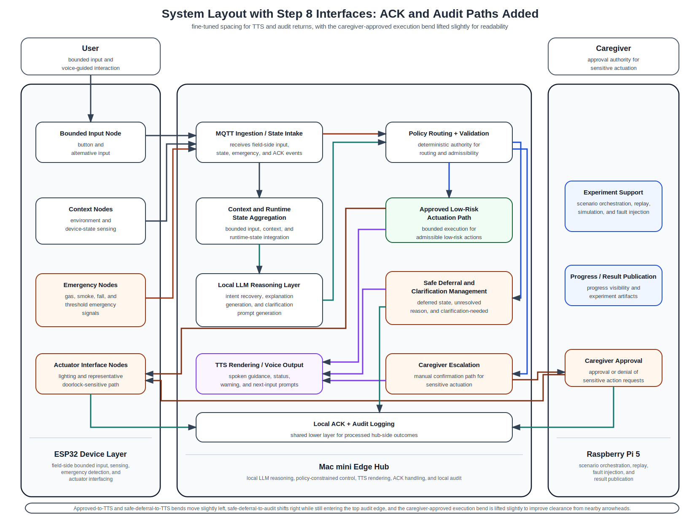

# 22_system_layout_step8_ack_audit_paths.md

## 1. Purpose

This document records the current **step-8 routed layout** in which the following interface categories are drawn:

- User Input Interface
- Context / State Interface
- Emergency Interface
- LLM Reasoning Interface
- Policy / Validation Branching Interface
- Execution / Approval Completion Interface
- TTS / Clarification Return Interface
- ACK / Audit Completion Interface

This routed version is now close to the full paper-oriented system figure.
It exists to validate how execution, approval, and deferred outcomes are returned into the local acknowledgement and audit layer after the user-facing TTS paths have already been established.

This document should be read together with:
- `common/docs/architecture/14_system_components_outline_v2.md`
- `common/docs/architecture/15_interface_matrix.md`
- `common/docs/archive/system_layout_figure_notes/16_system_block_layout_spacious.md`
- `common/docs/archive/system_layout_figure_notes/17_system_layout_step2_user_input_plus_context.md`
- `common/docs/archive/system_layout_figure_notes/18_system_layout_step4_with_llm_reasoning.md`
- `common/docs/archive/system_layout_figure_notes/19_system_layout_step5_policy_branching.md`
- `common/docs/archive/system_layout_figure_notes/20_system_layout_step6_execution_completion.md`
- `common/docs/archive/system_layout_figure_notes/21_system_layout_step7_tts_return_paths.md`

---

## 2. Current step-8 routed layout

---

## 3. What is included in this step

The routed interfaces currently included are:

### User Input Interface
- `User → Bounded Input Node`
- `Bounded Input Node → MQTT Ingestion / State Intake`

### Context / State Interface
- `Context Nodes → MQTT Ingestion / State Intake`
- `MQTT Ingestion / State Intake → Context and Runtime State Aggregation`

### Emergency Interface
- `Emergency Nodes → MQTT Ingestion / State Intake`
- `MQTT Ingestion / State Intake → Policy Routing + Validation`

### LLM Reasoning Interface
- `Context and Runtime State Aggregation → Local LLM Reasoning Layer`
- `Local LLM Reasoning Layer → Policy Routing + Validation`

### Policy / Validation Branching Interface
- `Policy Routing + Validation → Approved Low-Risk Actuation Path`
- `Policy Routing + Validation → Safe Deferral and Clarification Management`
- `Policy Routing + Validation → Caregiver Escalation`

### Execution / Approval Completion Interface
- `Approved Low-Risk Actuation Path → Actuator Interface Nodes`
- `Caregiver Escalation → Caregiver Approval`
- `Caregiver Approval → Actuator Interface Nodes`

### TTS / Clarification Return Interface
- `Approved Low-Risk Actuation Path → TTS Rendering / Voice Output`
- `Safe Deferral and Clarification Management → TTS Rendering / Voice Output`
- `Caregiver Escalation → TTS Rendering / Voice Output`

### ACK / Audit Completion Interface
- `Actuator Interface Nodes → Local ACK + Audit Logging`
- `Caregiver Approval → Local ACK + Audit Logging`
- `Safe Deferral and Clarification Management → Local ACK + Audit Logging`

Optional experiment-support publication completion paths should still be treated as not yet drawn in this figure.

---

## 4. Routing intent at this step

This step is intended to verify that:
- actuator-side execution outcomes are returned into the local acknowledgement and audit layer,
- caregiver-approved sensitive actions also produce audit-visible completion records,
- deferred outcomes are not only spoken through TTS but are also recorded in the audit layer,
- audit-return paths can be arranged with explicit entry locations that remain visually readable,
- and the lower audit layer is shown as a shared sink for locally processed outcomes.

This figure therefore supports the paper’s closed-loop safety claim that:
- execution, escalation, deferral, and approval outcomes are not left implicit,
- but are returned into an explicit local acknowledgement and audit mechanism,
- enabling traceability for safe deferral, approved execution, and caregiver-mediated actions.

---

## 5. Next expected step

The next optional interface category to add after this figure is:

- **Experiment-support / result-publication paths**

That optional final step may show routes such as:
- local audit outputs or scenario outcomes toward `Progress / Result Publication`,
- experiment orchestration relationships if they are still within the scope of the final paper figure,
- or any explicit publication/reporting paths needed for the validation architecture.

If those paths are not necessary for the final paper figure, step-8 may already serve as the effectively complete system-routing figure.
